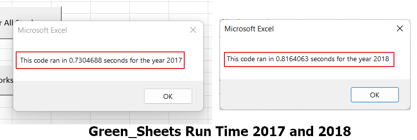
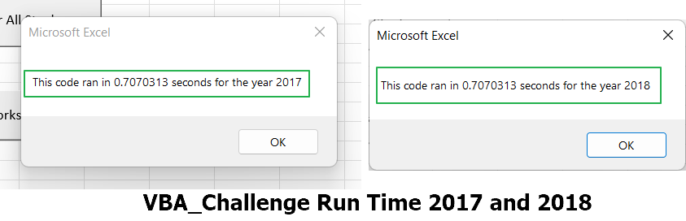

# Stock Analysis With VBA
## Overview of Project
### Purpose
 While
 
## Results and Analysis

### Refactoring VS Original Code
The original code included nested loops and two 

- bullet point example

#### Run Time for original code in Green_Sheets:

#### Run Time for VBA_Challenge was must faster:

## Summary
### Advantages and Disadvantages
 
### Pros and Cons
 
