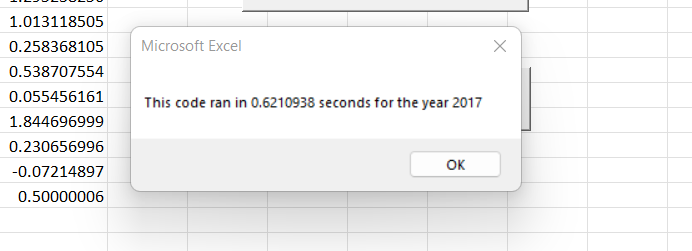
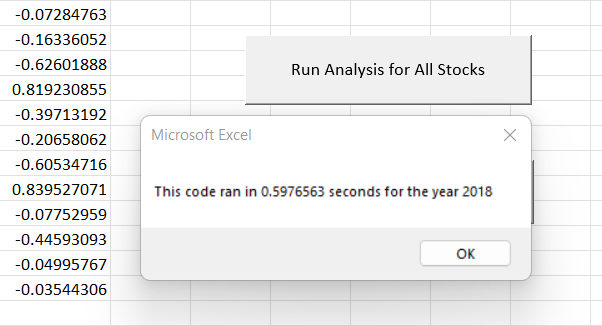

# Stock Analysis With VBA
## Overview of Project
### Purpose
 Initially, I was brought into this project by Steve to assist him with analyzing green energy stock data for his parents to invest in. While the code I produced worked well for the specific industry Steve needed to analyze, he now wants to go bigger and analyze all the stocks per year. To manage and efficiently run larger amounts of data such as all the stocks per year, I needed to refactor my code. Since it was originally written to be sufficient for smaller data frames, this would either take a long period of time to run or could have issues in the code that I would have to hunt down or adjust and could be time consuming. 
## Results and Analysis
### Refactoring VS Original Code
 The original code written for the green energy stocks included nested loops and was quite long. The refactored code was made to be simpler and easier to follow as well as adjustable if needed. It is better formatted and easier to read which is helpful to other programmers who might be handed this or want to use the code for themselves. By sectioning off tasks in the code by using if-then statements and for loops along with minor reformatting, the new code works much more efficiently as noted below.
#### Run Time for Original Code 
- The original code for 2017 ran in .07304688 seconds, and .08164063 seconds for 2018 as noted below:

#### Run Time for Refactored Code
-The new run times are much faster than those of the original code:

## Summary
### Advantages and Disadvantages
  Overall, refactoring helps code to be cleaner and more efficient through the many options of editing. This can include restructuring and organizing, changing repetitive codes out, or ensuring the code can be used for other portions of the data without being specific to just one. It also allows the code to be easier for another programmer to read and follow as well as the original created to go back and understand. 
 While the advantages of refactoring are many –I found it hard to believe there was any disadvantages. Originally it seemed to be like any other document a person could write – the more you edit the better it can become. That is not the case, Programming can include working in teams and when refactoring in groups – this can be problematic as different portions might not match what others are doing if code is constantly changing. Another disadvantage is the time it takes to refactor code and ensuring that it works as it originally was set to do or has bugs and issues.  At the end it did do as intended and ran faster than the original code, but the amount of time spend chasing bugs might not be worth the few extra seconds. I would need to test it with larger data frames to see a vast improvement. 
### Pros and Cons
 When I was first told about refactoring, I honestly couldn’t think of a reason for why it wouldn’t be in my best interest to make my code simpler and more efficient. That was until I had to refactor the code and experienced hands on what makes it complicated. Reviewing the process and creating shorter code was not as difficult as I had thought – mostly thanks to the comments added to each step that explain what the code below is set to do. Unfortunately, I did experience a lot of issues with some lines of code that took a very long time to debug, rewrite or fix in order for there to be no errors. VBA coding is definitely not as friendly as Python and bless anyone who has the patience for it.  
